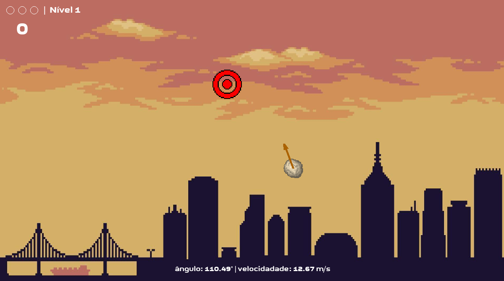
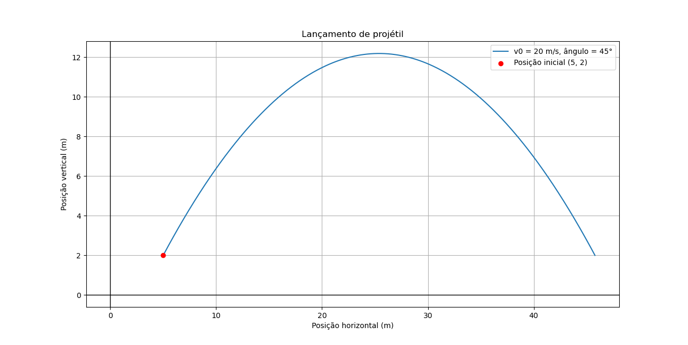
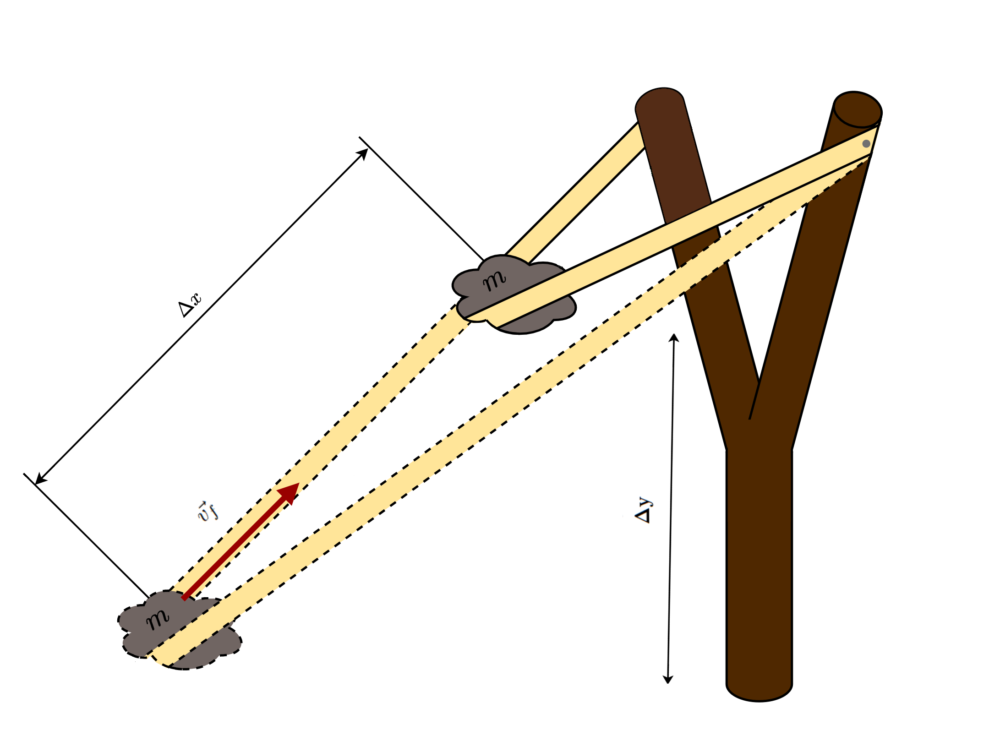

# Lançamento oblíquo
## Descrição básica do jogo 
Este projeto é um jogo em que o jogador controla o ângulo e a velocidade inicial do lançamento de um projétil circular de forma a tentar acertar um alvo que está em uma posição aleatória. Cada acerto é contabilizado e, após três erros, o contador é resetado. O objetivo é conseguir o maior número de acertos, sendo que o recorde é sempre atualizado a cada jogada. A **Figura 1** demonstra a tela de jogo, em que o usuário já pode lançar o projétil a seu gosto.

  <p align="center">
  
  <em>Figura 1: momento capturado durante uma sessão de jogo.</em>
  <br>
</p>


O lançamento do projétil é, na realidade, um caso particular de lançamento oblíquo: um objeto é lançado com um vetor velocidade inicial $$\vec{v_{0}}$$ e, a partir da ação da força de atração gravitacional direcionada ao centro da Terra (força peso), tem sua trajetória determinada. Foi feito, assim, uma modelagem matemática do lançamento e outra para se determinar o vetor $\vec{v_{0}}$, as quais foram implementadas em Python. 

## Modelagem matemática do lançamento oblíquo
Considere um sistema de coordenadas cartesiano bidimensional em que o canto inferior esquerdo da tela é a origem. Sejam $\hat{i}$ e $\hat{j}$ as direções, respectivamente, do eixo $x$ (para a esquerda - sentido positivo) e do eixo $y$ (para cima - sentido positivo). Considere ainda um objeto de massa $m$, lançado da posição $(x_{0}, y_{0})$ (no sistema de coordenadas definido) com um vetor velocidade inicial $\vec{v_{0}}$. Sua posição é denotada por $(x(t), y(t))$, em que $t$ é o parâmetro de tempo.

A fim de simplificações, 	<ins> desconsidera-se a ação da resistência do ar </ins>. Assim, a única força atuante no sistema é a força peso, direcionada verticalmente para baixo. Logo, sendo $\vec{F}$(t) a força resultante e $\vec{F_{g}}(t)$ a força peso, de acordo com a segunda lei de Newton:

$$ \begin{align}
\vec{F}(t) &=  \vec{F_{g}} \\
  m\vec{a}(t) &= -mg\hat{j} \\
  \vec{a}(t) &= -g\hat{j}
 \end{align} $$

 onde $g$ é a constante gravitacional terrestre e $\vec{a}$ é o vetor aceleração do objeto. Seja $(a_{x}(t), a_{y}(t))$ a representação cartesiana de $\vec{a}$. Então $a_{x}(t) = 0$ e $a_{y}(t) = -g$. Portanto, realizando integrações simples:
 
$$ \begin{align}
 v_{x}(t) &= a \\
  v_{y}(t) &= -gt + b \\
 \end{align} $$

 onde $v_{x}$ e $v_{y}$ são as componentes do vetor velocidade ($\vec{v}$), a e b são constantes arbitrárias. Para se determinar essas constantes, são utilizadas as condições iniciais $v_{x}(0) = |\vec{v_{0}}|\cos\theta = v_{0}cos\theta$ e $v_{y} = v_{0}\sin\theta$, em que $\theta$ é o ângulo entre $\vec{v_{0}}$ e o eixo $x$. Assim:

$$ \begin{align}
 v_{x}(t) &= v_{0}\cos\theta \\
  v_{y}(t) &= -gt + v_{0}\sin\theta \\
 \end{align} $$

 Integrando ambas as equações novamente:

 $$ \begin{align}
 x(t) &= v_{0}\cos\theta \cdot t + c \\
  y(t) &= d + v_{0}\sin\theta\cdot t - \displaystyle\frac{gt^{2}}{2} \\
 \end{align} $$

 onde c e d são constantes arbitrárias. Para determiná-las, usam-se as condições iniciais $x(0) = x_{0}$ e $y(0) = y_{0}$, de onde c = $x_{0}$ e d = $y_{0}$. Logo, a trajetória do projétil é dada pelas equações:

 $$ \fbox{$
 \begin{align} 
 x(t) &= x_{0} + v_{0}\cos\theta \cdot t \\
  y(t) &= y_{0} + v_{0}\sin\theta\cdot t - \displaystyle\frac{gt^{2}}{2} 
  \end{align}
  $}
  $$

  As equações obtidas para a trajetória do projétil descrevem um movimento parabólico. Um exemplo desse movimento é dado na **Figura 2**, em que se considera um lançamento oblíquo de velocidade inicial $v_{0} = 20m/s$ e ângulo inicial de 45°.

  <p align="center">
  
  <em>Figura 2: exemplo de trajetória de lançamento oblíquo. Gráfico criado com uso da biblioteca Matplotlib.</em>
  <br>
</p>

  ## Modelagem matemática da escolha da velocidade e do ângulo iniciais
 
 As equações obtidas para a trajetória do objeto lançado dependem do módulo do vetor velocidade inicial e do ângulo que esse vetor faz com o eixo $x$. É necessário, por conseguinte, que o usuário escolha esses valores. Para tal, foi desenvolvido um sistema que se assemelha a um estilingue: o usuário clica no objeto e, à medida que arrasta o *mouse*, controla o módulo do vetor e o ângulo que ele faz com o eixo das abcissas.

 Dessa forma, é evidente a similaridade desse efeito com o de uma força restauradora: o usuário realiza uma "força" no objeto em um sentido, e esse objeto é lançado no sentido oposto. Assim, pode-se modelar a situação como se houvesse um estilingue que realiza uma força elástica $\vec{F_{e}}$, proporcional à deformação do estilingue, no sentido oposto ao indicado pelo usuário. Como a força elástica é conservativa, a energia mecânica do sistema é conservada. Portanto, sendo $T$ e $U$, respectivamente, as energias cinéticas e potenciais do sistema:

 $$ \begin{align}
\Delta T = -\Delta U = - (\Delta U_{g} + \Delta U_{e})
 \end{align} $$

 onde $U_{g}$ e $U_{e}$ são, respectivamente, as energias potenciais gravitacional e elástica do sistema. Aqui será feita uma aproximação: supõe-se que a variação $\Delta y$ da altura do objeto seja suficientemente pequena para que $\Delta U_{g} << \Delta U_{e}$. Logo, se supormos que o objeto está em repouso no início da deformação e que a deformação inicial é nula, considerando o tempo $t_{f}$ de fim da deformação e início do lançamento do projétil e $\Delta x$ a deformação final:

$$ \begin{align}
T(t_{f}) - T(0) &\approx - (U_{e}(t_{f}) - U_{e}(0)) \\
|T(t_{f})| &\approx |U_{e}(t_{f})| \\
\displaystyle\frac{m(v(t_{f}))^{2}}{2} &\approx \displaystyle\frac{k(\Delta x)^{2}}{2} \\
v(t_{f}) &\approx \Delta x\sqrt{\displaystyle\frac{k}{m}}
 \end{align} $$

 onde $k$ é a constante elástica do estilingue. Encontramos então uma expressão para o módulo da velocidade inicial definida pelo usuário:
 
$$ \begin{equation}
v_{0} = v(t_{f}) \approx \Delta x\sqrt{\displaystyle\frac{k}{m}}  
\end{equation}$$

A **Figura 3** ilustra o funcionamento do estilingue, representando a deformação $\Delta x$, a variação da altura $\Delta y$, e o vetor velocidade $v_{f}$ obtido quando o objeto é lançado.

  <p align="center">
  
  <em>Figura 3: representação visual do funcionamento do estilingue. Imagem adaptada da internet.</em>
  <br>
</p>

Visto que o estilingue não existe realmente no jogo, a constante $k$ não nos interessa e, uma vez que a massa do objeto é constante e inacessível ao usuário, $m$ também não interessa. Portanto, o módulo da velocidade inicial é diretamente proporcional à deformação (no jogo, à distância entre o *mouse* e o objeto) e assim:

 $$ \fbox{$
 \begin{equation} 
 v_{0} \approx b\Delta x 
  \end{equation}
  $}
  $$

  para alguma constante $b > 0$. O ângulo inicial é determinado diretamente no código em Python.

  ## Implementação

  - **Linguagens e pacotes:**
  - Implementado em Python, o projeto se utiliza dos pacotes math, NumPy, Pygame e Random. Esses pacotes oferecem recursos matemáticos para as implementações das equações obtidas pelo modelo matemático e para a geração de números aleatórios, além de todo o aporte necessário para o desenvolvimento gráfico do jogo.


## Como usar

- É necessário que a versão 3.10, ou superior, da linguagem Python esteja instalada.
- Instale os pacotes mencionados na seção anterior com o pip:
   ```console
      pip install pygame
      pip install numpy
     ```
- Baixe todos os arquivos necessários para o funcionamento do programa com:
    ```console
      git clone https://github.com/raifernando/projeto-fisica-basica.git
    ```
    
- Para rodar o jogo, utilize o código:
  ```console
    python3 main.py
  ```
## Projeto
Este projeto foi desenvolvido por:
  
      Lucas Dúckur Nunes Andreolli: 15471518 - lucas.andreolli@usp.br
      Raí Fernando Dal Prá: 15506968 -
      Yan Trindade Meireles: 13680035 - yan.trindade@usp.br
      Rafael Perez Carmanhani: 15485420 - rcarmanhani@usp.br
    
  Para ser entregue como o projeto final que faz parte  do processo avaliativo da disciplina 7600105 - Física Básica I (2024) da USP-São Carlos ministrada pelos professores Krissia de Zawadzki e Esmerindo de Sousa Bernardes.

 ## Referências: 
 (1) Bernardes, E. de S. (2024). Dinâmica-v4 (Notas de aula). 7600105 - Física Básica I. Universidade de São Paulo, São Carlos.
 
  


 


